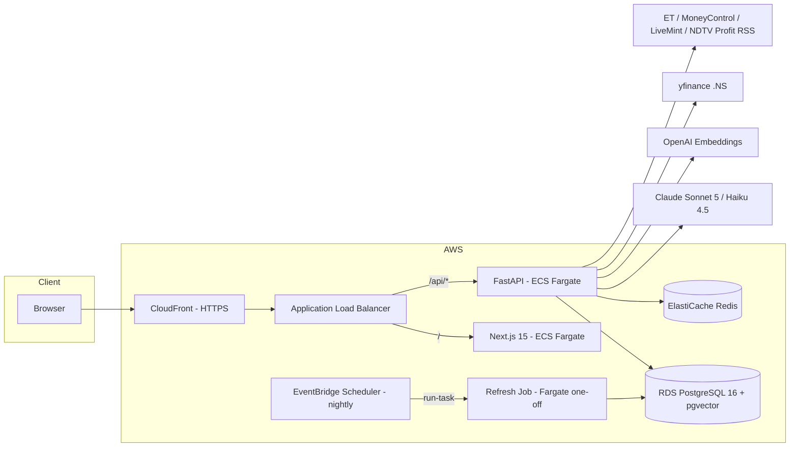
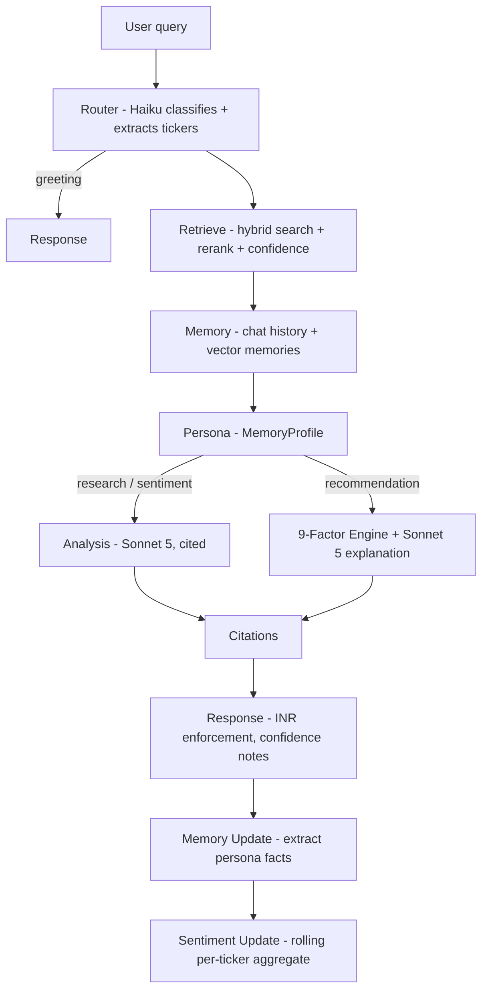

# Sentellent — Contextual Agentic AI Indian Stock Analyst

An **Equity Research Chief of Staff** for NSE/BSE markets. Users sign in with Google, follow Indian tickers (RELIANCE, TCS, HDFCBANK…), and the app ingests fundamentals + Indian financial news into a vector store. A LangGraph agent answers research questions with **grounded, cited responses in INR** — and learns each investor's persona over time.

> Built for the Sentellent Full Stack AI SDE Intern hiring challenge.
> **New here? Follow [START.md](START.md)** — ordered steps from clone → local run → AWS deploy → submission.

## Highlights

- **RAG done properly** — sentence-aware chunking, hybrid search (pgvector cosine + PostgreSQL full-text), LLM reranking, weighted confidence scoring, and a hard anti-hallucination gate: below-threshold retrievals answer *"I don't have that in the data."*
- **9-factor recommendation engine** — Fundamentals, Value, Growth, Risk, Momentum, Dividend, Quality, News Sentiment, and Persona Alignment scored **algorithmically** (no LLM call per stock), then explained by the LLM with citations.
- **Long-term memory** — investor persona extracted from every conversation, stored as vectors, ranked by similarity + confidence + recency decay, injected into every analysis.
- **Robust ingestion** — idempotent (SHA-256 content-hash dedup), concurrency-safe (PostgreSQL advisory locks held on a dedicated connection), and scheduled (nightly EventBridge refresh).
- **Production infrastructure** — Docker multi-stage builds, Terraform-provisioned AWS (ECS Fargate, RDS + pgvector, ElastiCache, ALB, CloudFront, Secrets Manager, CloudWatch), GitHub Actions CI/CD with OIDC (no long-lived AWS keys), rolling deploys with circuit-breaker rollback, and post-deploy smoke tests.

## Architecture



**Agent flow (LangGraph, 10 nodes):**



Full details: [docs/ARCHITECTURE.md](docs/ARCHITECTURE.md)

## Tech Stack

| Layer | Technology |
|---|---|
| Frontend | Next.js 15 (App Router), React 19, Tailwind, React Query, Zustand |
| Backend | Python 3.11, FastAPI (async), SQLAlchemy 2.0, Alembic |
| Agent | LangGraph + LangChain (`langchain-anthropic`) |
| LLMs | Claude Sonnet 5 (reasoning) + Haiku 4.5 (routing/tagging) |
| Embeddings | OpenAI `text-embedding-3-small` (1536-dim) |
| Vector store | pgvector on RDS PostgreSQL 16 (HNSW indexes) |
| Auth | Google OAuth 2.0 → JWT (httpOnly cookies, refresh rotation) |
| Infra | Terraform, ECS Fargate, RDS, ElastiCache, ALB, CloudFront |
| CI/CD | GitHub Actions (lint → test → build → deploy → migrate → smoke test) |

## Quick Start (Local)

```bash
cp .env.example .env          # fill in API keys + Google OAuth credentials
docker compose up --build
```

- Frontend: http://localhost:3000
- API docs: http://localhost:8000/api/docs
- Apply migrations: `docker compose exec backend alembic upgrade head`

Developer workflow without Docker: [docs/DEVELOPMENT.md](docs/DEVELOPMENT.md)

## Deployment (AWS)

```bash
make tf-bootstrap    # one-time: S3 state bucket + DynamoDB lock table
make tf-init
make tf-plan
make tf-apply        # provisions VPC, ECS, RDS, Redis, ALB, CloudFront, ECR, Secrets
```

Then populate Secrets Manager, set the `AWS_DEPLOY_ROLE_ARN` GitHub secret, and push to `main` — CI/CD builds, deploys, migrates, and smoke-tests automatically.

Full runbook (including the **Google OAuth test-user setup**): [docs/DEPLOYMENT.md](docs/DEPLOYMENT.md)

## Documentation

| Doc | Contents |
|---|---|
| [docs/ARCHITECTURE.md](docs/ARCHITECTURE.md) | System design, agent graph, RAG pipeline, memory system, data model |
| [docs/API.md](docs/API.md) | REST + SSE endpoint reference |
| [docs/DEPLOYMENT.md](docs/DEPLOYMENT.md) | AWS + Terraform + CI/CD runbook, OAuth setup, rollback strategy |
| [docs/DEVELOPMENT.md](docs/DEVELOPMENT.md) | Local setup, testing, migrations, project conventions |
| [docs/PRODUCTION_CHECKLIST.md](docs/PRODUCTION_CHECKLIST.md) | Pre-submission / go-live checklist |

## Challenge Compliance

| Requirement | Status |
|---|---|
| Google OAuth login (test users `harisankar@sentellent.com`, `naga@sentellent.com`) | ✅ Implemented — add the test users in GCP Console (see deployment guide) |
| Follow NSE/BSE ticker → ingest fundamentals + news → chunk/embed/index | ✅ |
| LLM tags article sentiment / impact / event / mentioned stocks | ✅ |
| Grounded, cited answers in INR; refuses when data is missing | ✅ Confidence-gated with per-source relevance scores |
| Investor persona from chat + persona-matched recommendations | ✅ Vector memory + 9-factor scorer |
| Efficient: cached embeddings, dedup, algorithmic ranking | ✅ Content-hash dedup; scoring is pure Python (39 unit tests) |
| Idempotent, concurrency-safe ingestion | ✅ Advisory locks + idempotency keys + hash dedup |
| Dockerized | ✅ Multi-stage builds, non-root frontend, health checks |
| Terraform (including vector store) | ✅ 16 files: VPC → ECS → RDS(pgvector) → CloudFront |
| CI/CD: push to `main` deploys automatically | ✅ GitHub Actions with OIDC, rolling deploy, auto-rollback |
| Scheduled news refresh (cron) | ✅ EventBridge Scheduler, nightly 02:00 IST |

## Disclaimer

This tool is for research and educational purposes. Nothing it produces is investment advice.
