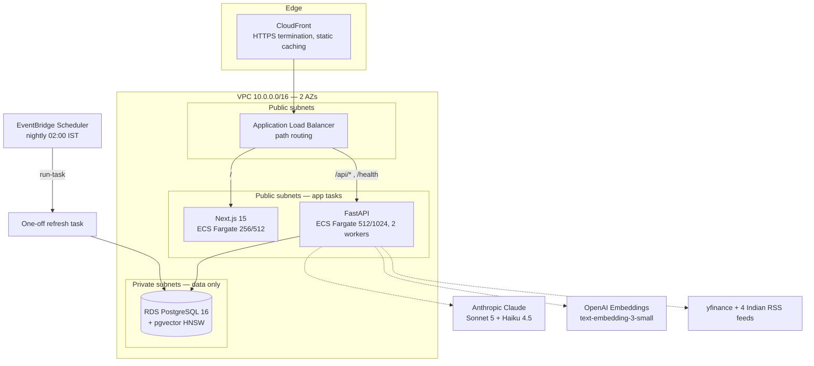
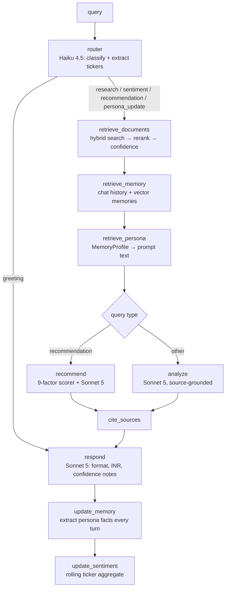

# Architecture

## System Overview



**Routing:** the browser talks only to CloudFront (HTTPS — required by Google OAuth). ALB path rules send `/api/*`, `/health` to FastAPI and everything else to Next.js. `/_next/static/*` is cached at the edge; all other paths use `CachingDisabled` + `AllViewer` (cookies pass through).

**Why pgvector over Pinecone/OpenSearch:** vectors co-located with relational data → citations join chunks↔articles↔tickers in one SQL query, hybrid (vector + full-text) search in a single CTE, one database to provision/backup, no extra SaaS cost.

## LangGraph Agent

State machine over `AgentState` (TypedDict). All LLM calls go through `langchain-anthropic`.



### Anti-hallucination design

1. **Confidence gate** — retrieval confidence = 0.40·avg relevance + 0.25·best + 0.20·high-quality ratio + 0.15·source diversity. Below **0.35** the agent answers *"I don't have sufficient information in the ingested data"* and recommendation generation is blocked.
2. **Citation enforcement** — prompts require `[Source N]` on every factual claim; the citation node resolves them to article title/URL/date/snippet with per-source relevance scores.
3. **Scorecard honesty** — factors without underlying data are `data_available: false`, excluded from the composite, and the LLM must say so.
4. **INR enforcement** — response node rejects USD phrasing; fundamentals are pre-formatted as Rs. / Lakh / Crore at ingestion.

## RAG Pipeline

```
RSS/yfinance → enrich (full text) → SHA-256 content hash → dedup
  → sentence-aware chunking (512 tok, 64 overlap, title+source header)
  → OpenAI embeddings (batch)
  → pgvector (HNSW, cosine) + stored tsvector (GIN)

query → embed → hybrid CTE (0.7 vector + 0.3 ts_rank_cd) top-25
  → Haiku rerank → top-6 → confidence score → agent
```

**Efficiency (challenge requirement):** embeddings are computed once per unique content hash — refollowing or re-ingesting never re-embeds. Stock scoring is pure Python (`recommendation/scorer.py`, unit-tested) — no LLM call per stock per query. The LLM only *explains* the pre-computed scorecard.

## Concurrency & Idempotency

- **Per-ticker advisory lock** held on a **dedicated DB connection** for the entire ingestion run (survives the pipeline's internal commits; auto-released on connection close even on crash). Concurrent runs — e.g. scheduled refresh vs. manual follow — return `locked` instead of double-processing.
- **Idempotency keys** on ingestion jobs; a `running` job row with no live lock is detected as stale and safely re-run.
- **Content-hash + URL dedup** before any embedding call: re-running ingestion on the same data creates zero duplicates.

## Long-Term Memory

- `user_memories`: 7 categories (risk_appetite, investment_style, sector_preferences, goals, avoided/preferred stocks, general) with 1536-dim embeddings, confidence, supersedes-lifecycle (contradictory facts deactivate old ones).
- Extraction runs on **every** non-greeting turn (Haiku), not just explicit "I am conservative" statements.
- Retrieval ranks by 0.45·similarity + 0.30·confidence + 0.25·recency (exp decay, 90-day half-life-ish).
- Category facts sync to a flat `investor_personas` row for fast reads; both merge into a `MemoryProfile` injected into analysis and recommendation prompts.

## Data Model (core tables)

```
users ─┬─ refresh_tokens
       ├─ user_tickers ─── tickers ── ticker_sentiment
       ├─ chat_sessions ── chat_messages (citations JSONB)
       ├─ investor_personas
       ├─ user_memories (vector 1536, HNSW)
       └─ recommendations (scores JSONB = full scorecard)

articles ─┬─ article_chunks (vector 1536 HNSW, tsvector GIN)
          └─ article_tickers ── tickers
fundamentals_chunks (vector 1536, per ticker)
ingestion_jobs (idempotency_key unique, status)
audit_logs
```

Migrations: Alembic (4 revisions), UUID v7 keys, soft-delete on users.

## Security

- OAuth CSRF `state` verification; JWT in httpOnly/SameSite=Lax cookies; refresh rotation with server-side SHA-256 hashed tokens + revocation.
- Secrets only in AWS Secrets Manager (incl. full `DATABASE_URL`) — task definitions carry ARNs, not values.
- RDS in private subnets with no egress route; ECS tasks run in public subnets (no NAT Gateway) but accept inbound traffic only from the ALB security group. No public DB access.
- GitHub Actions authenticates via OIDC — no long-lived AWS keys in CI.
- SSE errors return generic messages; details stay in CloudWatch logs.
